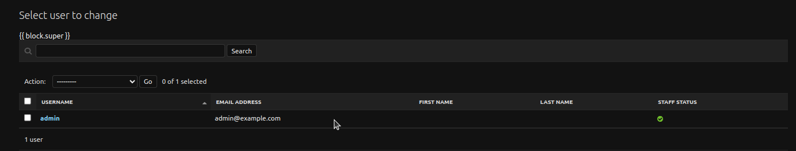
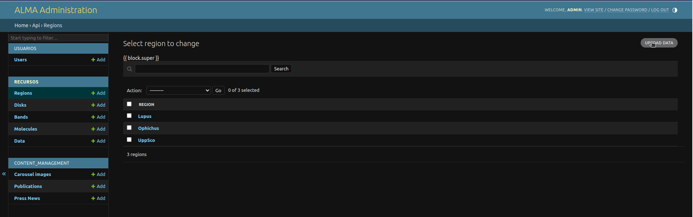
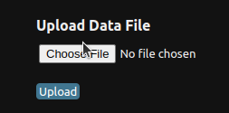
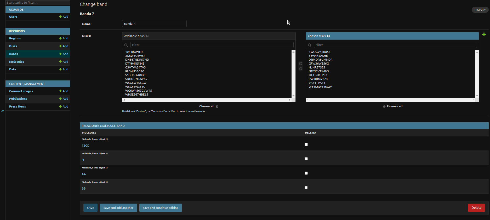

# BackOffice de ALMA

El BackOffice de ALMA es una interfaz administrativa construida utilizando Django Admin. Esta interfaz permite a los administradores del sistema gestionar el contenido y los datos almacenados en la base de datos de ALMA de manera eficiente y segura.

## Configuración
La configuración del BackOffice se encuentra principalmente en los archivos `alma/admin.py` y `content_management/admin.py`. En estos archivos, se registran los modelos y se personalizan las vistas administrativas.

## Modelos Registrados
Los siguientes modelos están registrados en el BackOffice y son gestionables a través de la interfaz de Django Admin:

- **Usuarios**: Gestión de usuarios del sistema.
- **Regiones, Discos, Bandas, Moléculas, Datos**: Modelos relacionados con la información astronómica, registrados desde el módulo api.
- **Imágenes del Carrusel, Publicaciones, Noticias de Prensa**: Contenidos gestionables desde el módulo content_management.
Personalizaciones

Se han realizado diversas personalizaciones en las vistas administrativas para mejorar la experiencia del usuario administrador. Algunas de estas personalizaciones incluyen:

- Filtros y Campos de Búsqueda: Facilitan la búsqueda y filtrado de registros específicos dentro de las categorías gestionables.
- Campos de Solo Lectura y Campos Personalizados: Para algunos modelos, se han definido campos de solo lectura y campos personalizados que mejoran la visualización de la información, como la conversión de Markdown a HTML o la visualización de imágenes.

## Acceso
Para acceder al BackOffice, es necesario tener credenciales de administrador. Una vez autenticado, el BackOffice se puede acceder a través de la ruta `/admin`.

Para entrar por primera vez, se debe crear un superusuario. Para ello, se debe correr el siguiente comando en la terminal:

```bash
make createsuperuser
```

Este comando creará un superusuario de nombre `admin` y contraseña `admin`. Se recomienda crear un superusuario personalizado con credenciales seguras y eliminar el superusuario por defecto.



## Gestión de Contenido
El BackOffice permite realizar operaciones CRUD (Crear, Leer, Actualizar, Eliminar) sobre los modelos registrados. Además, ofrece herramientas para la gestión de usuarios y la personalización de la interfaz.

### Agregar datos a partir de archivos CSV
Para facilitar la carga masiva de datos, se ha implementado una funcionalidad que permite importar registros a partir de archivos CSV. Para acceder a esta funcionalidad, se debe entrar a alguno de los modelos de datos y cliquear en el botón "Upload Data" en la esquina superior derecha de la pantalla.



Una vez en la página de carga de datos, se debe seleccionar el archivo CSV a importar y cliquear en el botón "Upload". Los registros del archivo CSV se importarán a la base de datos y se mostrarán en la lista de registros del modelo correspondiente.



### Crear y modificar datos manualmente

El BackOffice permite crear y modificar registros manualmente a través de formularios personalizados. A continuar se muestra un ejemplo de una Banda.



Aqui se puede modificar la banda seleccionada:
- Se puede cambiar el nombre de la banda
- Se puede cambiar a qué discos pertenece: se puede seleccionar uno o varios discos, los discos de la izquierda son los que no pertenecen a la banda, los de la derecha son los que sí pertenecen a la banda.
- Se puede ver qué moléculas pertenecen a la banda, y se pueden eliminar moléculas de la banda desde aquí.

